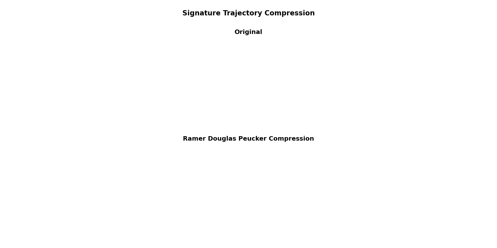

### Online Signature Verification



#### Description
This repository implements an SVM-based online signature verification system using time-series signature data from digital input devices. Unlike offline signature verification that processes signatures as static images, online signatures capture dynamic behavioral characteristics such as pen pressure, velocity, acceleration, and elevation during the signing process. This provides significantly more security and accuracy in distinguishing genuine signatures from forgeries. A novel preprocessing pipeline leverages the Ramer-Douglas-Peucker (RDP) algorithm for signature compression while preserving essential dynamic features—achieving compression ratios of 30-81% without significant information loss.

The project demonstrates that traditional machine learning approaches can achieve competitive accuracy (83.78% for binary classification) with substantially lower computational overhead compared to deep learning methods, making it practical for deployment in resource-constrained environments.

#### Setup
In order to set up the environment and install the dependent libraries, run the below commands:
```bash
conda create -n "osr" python=3.12
conda activate osr
pip install -r requirements.txt
```

#### Usage

```bash
# Explore the signature dataset interactively
jupyter notebook Sign_clean.ipynb
```

```bash
# Train and evaluate SVM binary classifier
jupyter notebook svm_sign_roc.ipynb
```

```bash
# Train multiclass classifier for user identification
jupyter notebook sign-multiclass-classification.ipynb
```
